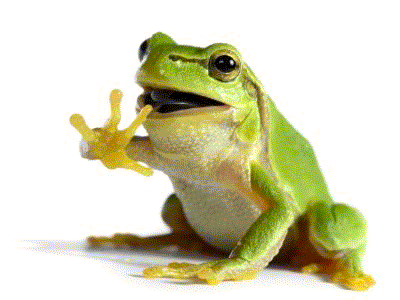

<h1 align="center">3koo2</h1>

Hi! I'm 3koo2, a frog enthusiast who loves to code.

^^ This is Frgo ^^

<h1>Who is Frgo?</h1>

Frgo is a frog. He says "ribbit", and jumps very high. He is also the subject of <a href = "https://frgo.org">frgo.org,</a> a website dedicated to creating games and fun games.

He likes <a href = "https://frgo.org/games/frgoparty/" target = "_blank">to party!</a>

<h1>About me</h1>

Like I said, I love to code.

> This user has been spotted writing code in:
Python, JavaScript, Java, C/C++, and PHP.

Another thing to know about me is that I usually get bored when doing things I don't really enjoy, such as creating readme files.
